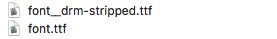

##### RED Interactive Agency - Ad Technology

# font-fixer

This package utilizes a publically available C program that removes DRM from `.ttf` fonts. It is utilized for brand-owned fonts that need to serve in-banner, in particular Internet Explorer which will refuse to load a licensed font.

## CLI Usage

NOTE: Once this project is installed locally, you only need to do Step 4 to fix your fonts:

1. Download & Unzip this repo
2. `cd` into unzipped project folder
3. `npm install`
4. `npm run fix /path/to/font.ttf`

This will yield

where the `font__drm-stripped.ttf` version is the browser-safe font.

## Legal Warnings

In all cases, the font must be reduced from its full set of glyphs to only the characters that are required for that ad unit to run. Use [Type Tool 3](https://old.fontlab.com/font-editor/typetool/) for this purpose.

Furthermore, RED Ad Tech repackages the remaining glyphs in our binary asset packer, making the compromised font essentially unusable for any other purpose.
